# thesis
graduate thesis

老师好！
这周我写了简单的代码。
这个代码会提取医学图像中的对象，做Logstic映射加密，然后放回去。
论文题目是医学图像感兴趣区域加密，不过我还是不太明白感兴趣区域指的是什么。
我的理解是题目里没有明确的定义感兴趣区域，所以所谓感兴趣区域就是图像中删掉背景黑色部分后剩下的部分。
老师，我理解的对吗？还是我要提取更具体的部分吗？
加密算法是参考【基于混沌系统的数字图像加密算法研究 2019.6】写的。
混沌序列中使用了图像中像素信息。通过排序混沌序列打乱像素的位置。
图像提取使用的是opencv提供的函数，写的有点粗暴 :-(。
混沌序列公式（参考论文的内容）
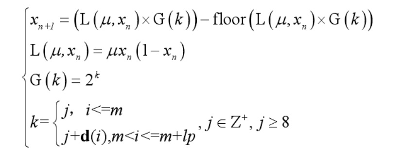
m 是为消除暂态效应的不良影响而舍去的混沌序列的前 m项，d(i)为ROI的低四位矩阵的元素值，lp为ROI的像素总数。
ROI提取过程如下：
锐化->强化对比度->提取边缘->提取形态->删除小的孔

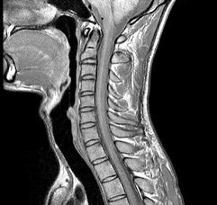

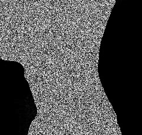

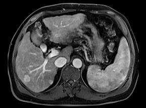

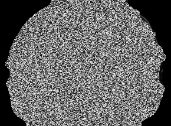

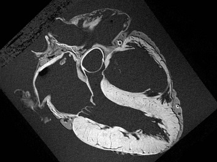
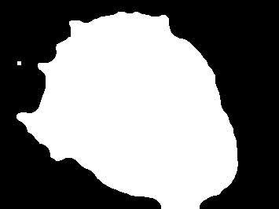
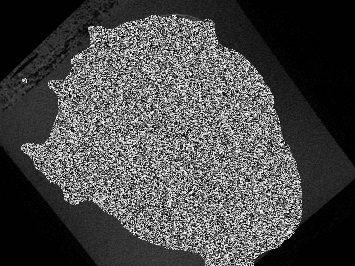

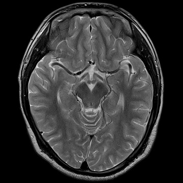
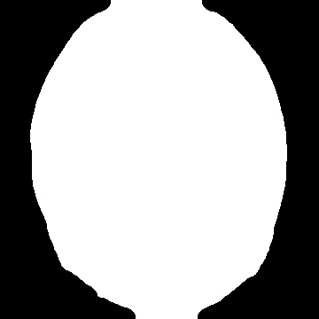
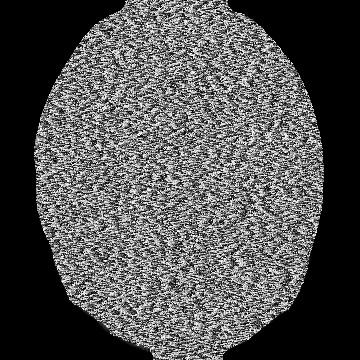
